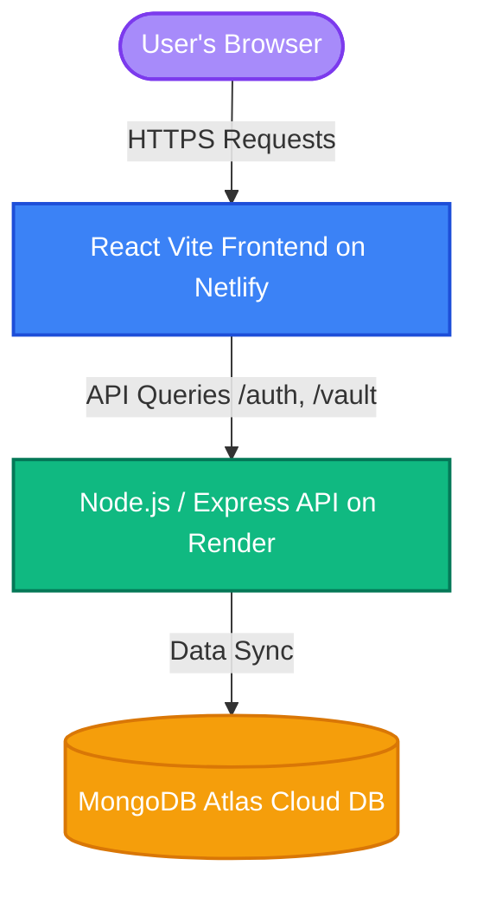
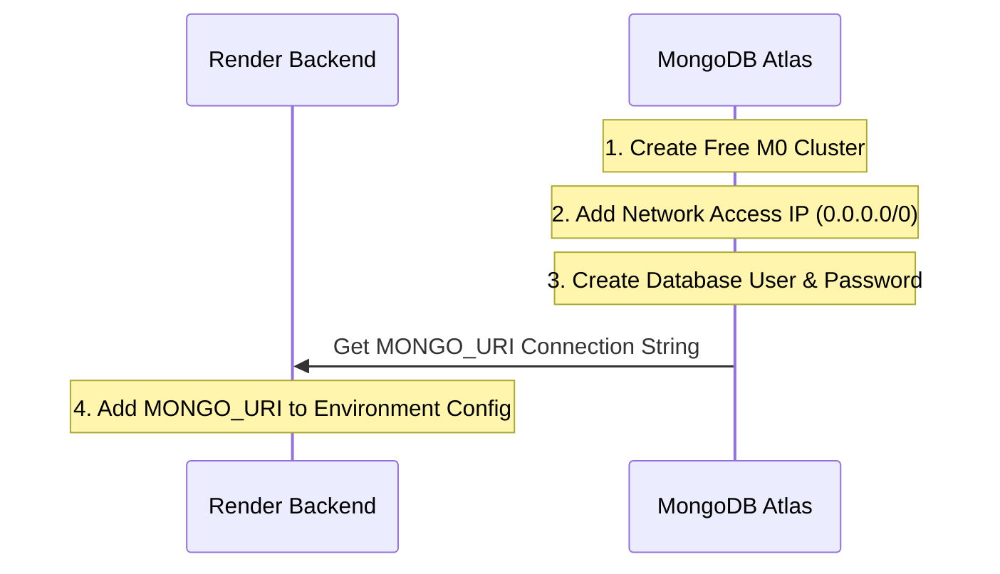

# 🚀 Production Deployment Guide: LifePause SaaS Platform

Welcome to the official deployment guide for **LifePause - Emergency Digital Manager**. This document provides an all-inclusive, step-by-step walkthrough to get your full-stack application running live in production using modern, free-tier cloud platforms.

---

## 🏗️ Production Architecture Overview

The LifePause platform is structured as a full-stack monorepo:



### ⚡ Cloud Services Stack
| Component | Platform | Plan | Purpose |
| :--- | :--- | :--- | :--- |
| **Database** | **MongoDB Atlas** | Shared Cluster (M0) | Fully-managed cloud NoSQL database |
| **Backend API** | **Render** | Web Service (Free) | Production runtime for Node.js / Express |
| **Frontend UI** | **Netlify** | Web App (Free) | Global CDN edge-hosting for static React files |

---

## 📌 Prerequisites
Before starting, ensure you have:
1. A [GitHub Account](https://github.com/) 🐙
2. A [MongoDB Atlas Account](https://www.mongodb.com/cloud/atlas/register) 🍃
3. A [Render Account](https://render.com/) 🟣
4. A [Netlify Account](https://www.netlify.com/) ⚡
5. [Git installed](https://git-scm.com/) on your local machine.

---

## 🛠️ Step-by-Step Deployment Walkthrough

---

### 📂 Phase 1: Prepare and Push to GitHub

Since both Render and Netlify leverage Git-based continuous integration (CI/CD), pushing your workspace code to a remote GitHub repository is the crucial first step.

#### 1. Open Terminal/Command Prompt
Navigate to your workspace root directory:
```bash
cd "c:\Users\Sonal Tripathi\OneDrive\Desktop\lifepause"
```

#### 2. Verify Git Initialization
Ensure a git repository is initialized locally. If not, run:
```bash
git init
```

#### 3. Stage and Commit Files
Add all project files (ignoring `node_modules` automatically via `.gitignore`):
```bash
git add .
git commit -m "feat: ready for cloud production deployment"
```

#### 4. Push to a New GitHub Repository
1. Go to [GitHub](https://github.com/) and click **New Repository**.
2. Name your repository `lifepause` (set it to **Private** or **Public**).
3. Do not initialize with README, `.gitignore`, or license.
4. Copy the remote repository URL commands and run them:
   ```bash
   git remote add origin https://github.com/<your-username>/lifepause.git
   git branch -M main
   git push -u origin main
   ```

---

### 🍃 Phase 2: Deploy Cloud Database (MongoDB Atlas)

The Express backend connects to a database. In production, we replace our local MongoDB instance with **MongoDB Atlas**.



#### Step 2.1: Create a Free Cluster
1. Sign in to your **MongoDB Atlas** console.
2. Click **Create** to deploy a new cluster.
3. Select **M0 (Shared)** under the deployment options (this is 100% Free).
4. Choose your preferred cloud provider (e.g., AWS) and region nearest to you.
5. Click **Create Cluster**.

#### Step 2.2: Set Up Database Security
1. **Create Database User**: Under *Security -> Database Access*:
   - Click **Add New Database User**.
   - Select **Password** authentication.
   - Enter a username (e.g., `db_admin`) and a strong password. **Write this down safely!**
   - Assign the role `Read and write to any database`.
2. **Configure Network Access**: Under *Security -> Network Access*:
   - Click **Add IP Address**.
   - Choose **Allow Access From Anywhere** (IP Address: `0.0.0.0/0`).
     > [!WARNING]
     > Render Web Services use dynamic IP addresses. Whitelisting `0.0.0.0/0` is necessary so the Render server can establish a connection with your database securely using your database credentials.

#### Step 2.3: Get your Connection String
1. Under *Database -> Clusters*, click the **Connect** button next to your active database.
2. Select **Drivers** (Node.js).
3. Copy the provided connection string. It will look like this:
   ```text
   mongodb+srv://db_admin:<password>@cluster0.xxxx.mongodb.net/?retryWrites=true&w=majority&appName=Cluster0
   ```
4. Replace `<password>` with the actual password you created for your database user. Make sure to replace any special characters with standard URI encoding if necessary.
5. Change the default database name inside the connection string (usually before the `?` query mark) to `lifepause`. Example:
   `...mongodb.net/lifepause?retryWrites=true...`

---

### 🟣 Phase 3: Deploy Backend API Server (Render)

Render automatically handles hosting, building, and running Node.js projects directly from GitHub.

#### Step 3.1: Create a New Web Service
1. Log in to your **Render** dashboard.
2. Click **New +** and select **Web Service**.
3. Link your GitHub account and choose your `lifepause` repository.

#### Step 3.2: Configure Build Settings
Fill in the deployment details exactly as follows:

| Field | Configuration Value | Description |
| :--- | :--- | :--- |
| **Name** | `lifepause-backend` | Name of your Render Web Service |
| **Region** | Select region closest to your DB | Minimizes database connection latency |
| **Branch** | `main` | Production deployment source branch |
| **Root Directory** | `backend` | **CRITICAL:** Tells Render to execute inside the `backend` folder |
| **Runtime** | `Node` | Runtime engine |
| **Build Command** | `npm install` | Installs dependencies |
| **Start Command** | `npm start` | Launches server via `node server.js` |
| **Instance Type** | `Free` | Zero-cost development slot |

#### Step 3.3: Set Environment Variables
Scroll down and click **Advanced** -> **Add Environment Variable**. Add the following:

| Key | Value | Description |
| :--- | :--- | :--- |
| `NODE_ENV` | `production` | Sets server to run in production mode |
| `MONGO_URI` | *Your copied MongoDB Atlas string from Phase 2* | Connection to cloud database |
| `JWT_SECRET` | *Generates a random key e.g. `lp_prod_secret_9988_#$@!`* | Cryptographic salt for authentication tokens |

> [!TIP]
> Once you click **Create Web Service**, Render will start building your backend. The first build can take 2-4 minutes as Render sets up the environment. Watch the console logs for the message: `Server running in development mode on port 10000` (Render overrides the port variable dynamically) and `MongoDB Connected`.
> Copy your live backend service URL (e.g., `https://lifepause-backend.onrender.com`).

---

### ⚡ Phase 4: Deploy React Frontend Client (Netlify)

Since a static React build doesn't require server-side execution, hosting it on Netlify's high-speed CDN guarantees blistering load times.

#### Step 4.1: Import from Git
1. Log in to the **Netlify** Dashboard.
2. Click **Add new site** -> **Import an existing project**.
3. Select **GitHub** as the provider and choose your `lifepause` repository.

#### Step 4.2: Build Settings Configuration
Netlify automatically looks for build variables, but since this is a monorepo setup, you must target the `frontend` sub-directory:

| Field | Configuration Value | Description |
| :--- | :--- | :--- |
| **Base directory** | `frontend` | **CRITICAL:** Directs Netlify build commands inside the `frontend` folder |
| **Build command** | `npm run build` | Compiles Vite React code into static assets |
| **Publish directory** | `dist` | The compilation output folder (sub-directory under base) |

#### Step 4.3: Add Environment Variables
Before deploying, click **Add Environment Variables** (or set them under Site Settings later):

| Key | Value | Description |
| :--- | :--- | :--- |
| `VITE_API_URL` | `https://your-backend.onrender.com/api` | Point this to your Render service live URL, **appending `/api` at the end** |

#### Step 4.4: Deploy Site
1. Click **Deploy lifepause**.
2. Netlify will compile your Vite application. Once completed, your site is live! You will receive a unique Netlify subdomain (e.g., `https://your-custom-site.netlify.app`).

---

## 🔍 Phase 5: Verification and Live Inspection

Your full-stack application is live! Here is how to test and verify the operational pipeline:

1. **Verify Live Backend Status**:
   Visit `https://your-backend.onrender.com` in your browser. You should receive a status response:
   ```json
   {
     "message": "Welcome to the LifePause API.",
     "status": "online",
     "timestamp": "2026-05-26T08:38:00.000Z"
   }
   ```
   *If `status` says `database_offline`, double-check your `MONGO_URI` credential and ensure MongoDB Network Access whitelist is set to `0.0.0.0/0`.*

2. **Verify Frontend API Integration**:
   Open your Netlify URL, open your browser Console (F12) -> **Console** tab. You should see:
   `LifePause Backend connected successfully. Running in Live mode.`
   This indicates that your frontend successfully initiated connection checks and bridged to the production Render database!

3. **Robust Fallback Safeguard (Demo Mode)**:
   If the backend is ever offline (e.g., when the Free tier Render server is waking up from spin-down), your app will display a notification:
   `LifePause Backend is offline. Running in Demo (localStorage) mode.`
   The app will still let users interact seamlessly using local storage simulation!

---

## 🩺 Troubleshooting Guide

### ❌ Problem: Render Backend Build Fails
* **Fix**: Ensure that your **Root Directory** on Render is explicitly set to `backend`. If it is left empty, Render will try to run commands in the root where there is no `package.json`.

### ❌ Problem: Netlify Blank Page on React Router Refresh
* **Fix**: The existing `netlify.toml` in your frontend directory is pre-configured to redirect all requests to `index.html` (Single Page Application routing). Make sure your base directory on Netlify is correctly set to `frontend` so it imports this `netlify.toml` rule!

### ❌ Problem: CORS Errors in Console
* **Fix**: LifePause's Express server uses a wildcard CORS policy `app.use(cors())`, which permits requests from any origin by default. This makes it instantly compatible with your Netlify URL without additional configurations.

---

🎉 **Congratulations! Your LifePause SaaS platform is live in the cloud!** Feel free to customize your Netlify domain name or map a custom top-level domain via Netlify DNS settings.
